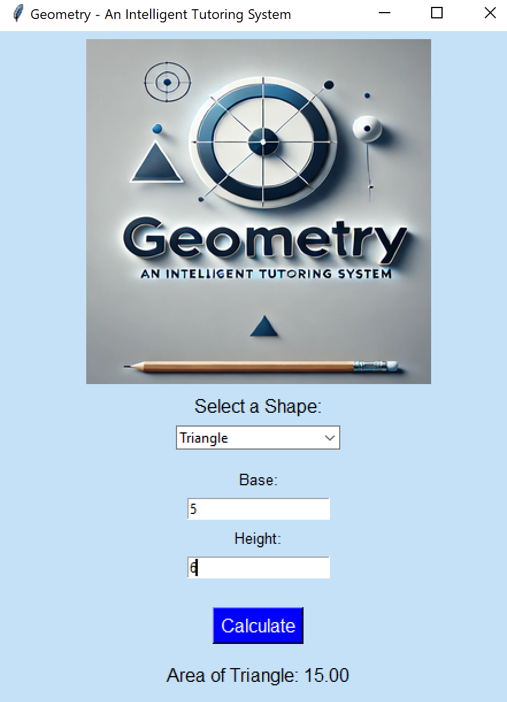

# Geometry-An_Intelligent_Tutoring_System

An interactive geometry tutoring system built with Python. This application leverages Tkinter for a graphical user interface and Owlready2 to integrate ontology for reasoning. Users can calculate areas and volumes of basic geometric shapes like circles, cubes, spheres, squares, and triangles.

Features:

User-Friendly GUI: Built with Tkinter for an intuitive interface.
Shape Calculations: Calculates the area and volume of geometric shapes.
Ontology Integration: Uses Owlready2 to load a geometry ontology.
Shape-Specific Parameters: Dynamically generates input fields based on the selected shape.
Error Handling: Includes validation for user inputs with informative error messages.

Technologies Used:

Python (3.x)
Tkinter (for GUI)
Owlready2 (for ontology-based reasoning)
Pillow (for image handling)

Installation:
1. Clone the Repository:

git clone https://github.com/PrashrayaG/Geometry-An_Intelligent_Tutoring_System.git
cd Geometry-An_Intelligent_Tutoring_System

2. Install Dependencies: Use pip to install the required libraries:

pip install pillow owlready2

3. Prepare Files:

Ensure GeometryOntology.owl is placed in the same directory.
Add a logo.png file to serve as the application logo.

Usage
1. Run the Application: Execute the script:

python main.py

2. Select a Shape:
Choose a shape from the dropdown menu (Circle, Cube, Sphere, Square, Triangle).

3. Enter Parameters:
Input the required dimensions (e.g., radius, side length, base, height).

4. Calculate:
Click the "Calculate" button to compute the area or volume.
Results will be displayed below the button.

Dependencies:
Python 3.x
Owlready2
Pillow
Tkinter (comes pre-installed with Python)

